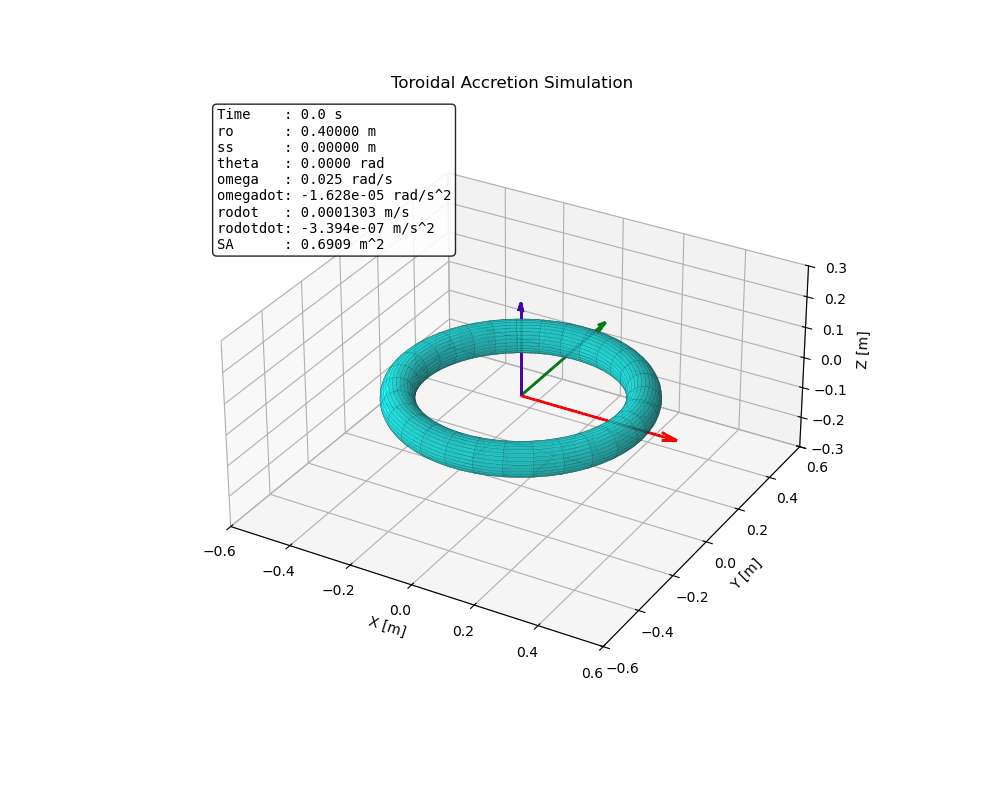

# Dynamic-Toroidal-Accretion-RK4
This is a simulation for a dynamic toroid that grows and spins. It is assumed that the tangent velocity and volume accretion rates are constant. RK4 is used for integration. An animation for debugging is generated.

## Animation

